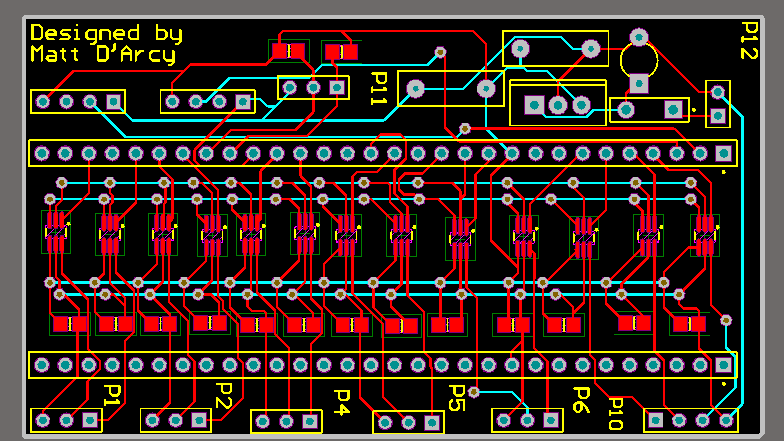
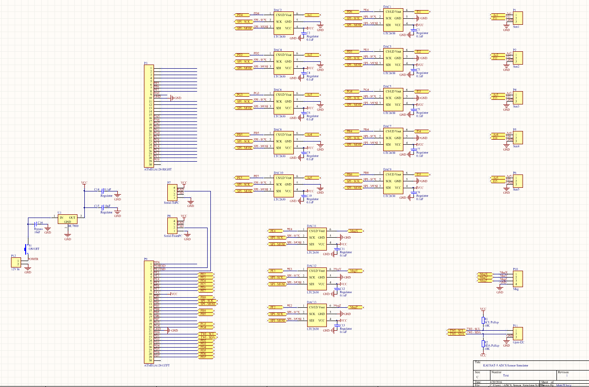
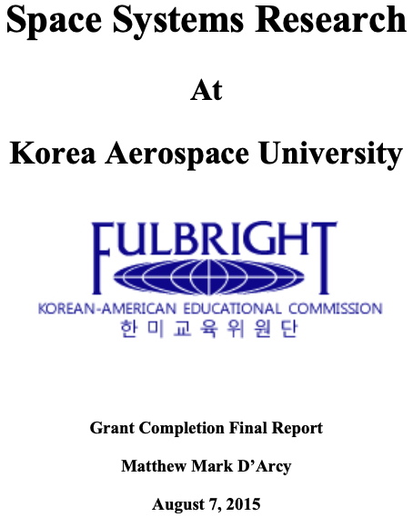

# KAUSAT-5 Sensor Simulator

**Summary**

MATLAB/Embedded C software for the ADCS sensor simulator for KAUSAT-5, a 3U CubeSat developed at Korea Aerospace University's [Space Systems Research Laboratory](https://www.facebook.com/ssrlmm/). This was the main work of my 2014-2015 Fulbright grant to South Korea. The complete system was capable of delivering real-time simulated sensor data from the MATLAB-STK interface via ATMega128 to KAUSAT-5's ADCS board for on-the-ground debugging purposes.

Simulated sensors included 5x sun, x-y-x mag, and x-y-z gyro. 
Data transfer protocols included UART, SPI, I2C.

**>>> [Check Out On YouTube](https://www.youtube.com/watch?v=KioAFfxGl1A) <<<**

**Hardware**

ATMega128 (1x as simulator unit, 1x as MASTER for simulator verification)  
LTC2630 Digital-Analog Converter (13x)  
Simulator PCB (1x) created in Altium Designer v13.2
See documentation folder for details

**Embedded**

Embedded code was compiled with IAR Embedded Workbench IDE v6.7.  
Embedded code divided into MASTER and SLAVE according to TWI scheme.  
System design scheme implies the sensor simulator itself is SLAVE, and verification unit (in this case my pc, but generally KAUSAT-5) is MASTER.

**SLAVE**

To open in IAREW, open Sensor_Simulator.eww in Embedded/SLAVE311  
To see individual .c and .h files, go to Embedded/SLAVE311/standard

**MASTER**

To open in IAREW, open MASTER315.eww in Embedded/MASTER315  
To see individual .c and .h files, go to Embedded/MASTER315

**Final Report**

The material in this repository and final report is my own and does not reflect the stance nor view of the State Department, Fulbright Korea, nor Korea Aerospace University.

---

© 2020 [Matt D'Arcy](http://linkedin.mathewdarcy.com), shared under the [MIT License](http://www.opensource.org/licenses/MIT).
